# PrashnaSārathi (प्रश्नसारथि) — Community Q&A and FAQ Platform

<div align="center">
  
</div>

<br>

A community-driven Q&A and FAQ platform designed to help students ask doubts without fear, get answers fast, and feel their problems are genuinely solved.

**Live Demo:** [https://prashnasarathi.vercel.app/](https://prashnasarathi.vercel.app/)

---

## Team Members

| Name | Email |
|------|-------|
| Arjun Sharma | arjun.sharma@prashnasarathi.com |
| Priya Patel | priya.patel@prashnasarathi.com |
| Rahul Verma | rahul.verma@prashnasarathi.com |
| Sneha Reddy | sneha.reddy@prashnasarathi.com |
| Vikram Singh | vikram.singh@prashnasarathi.com |
| Ananya Nair | ananya.nair@prashnasarathi.com |
| Manoj Kumar | manoj.kumar@prashnasarathi.com |
| Neha Gupta | neha.gupta@prashnasarathi.com |

---

## Tech Stack

| Layer     | Technology                                      |
| --------- | ----------------------------------------------- |
| Frontend  | Next.js 14 (App Router), React 18, Tailwind CSS |
| Backend   | Node.js, Express 4, MongoDB (Mongoose), Redis   |
| Search    | Elasticsearch                                   |
| Realtime  | Socket.IO                                       |
| Events    | Kafka (optional)                                |
| Infra     | Podman / Docker, Nginx                          |

---

## Key Features

### Q&A Core

#### Ask Questions
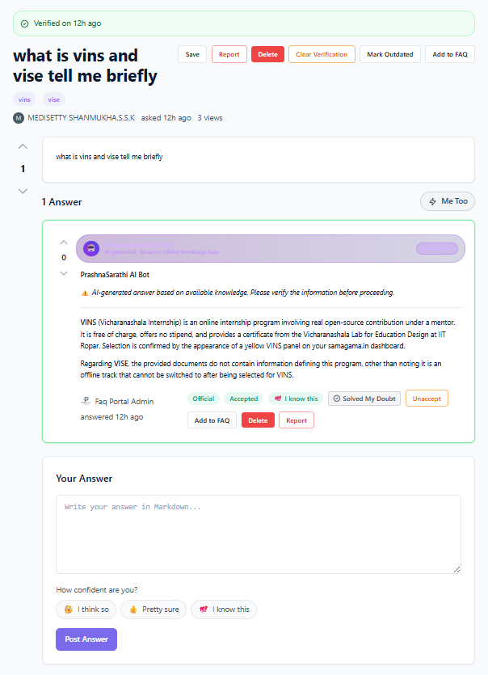
- Create questions with title, rich text body, and tags
- Anonymous posting option for sensitive doubts
- Duplicate detection before posting

#### Similar Questions Detection

- Prevents duplicate questions before posting
- Shows similar existing questions
- Reduces clutter and encourages consolidation

#### Content Quality Filtering
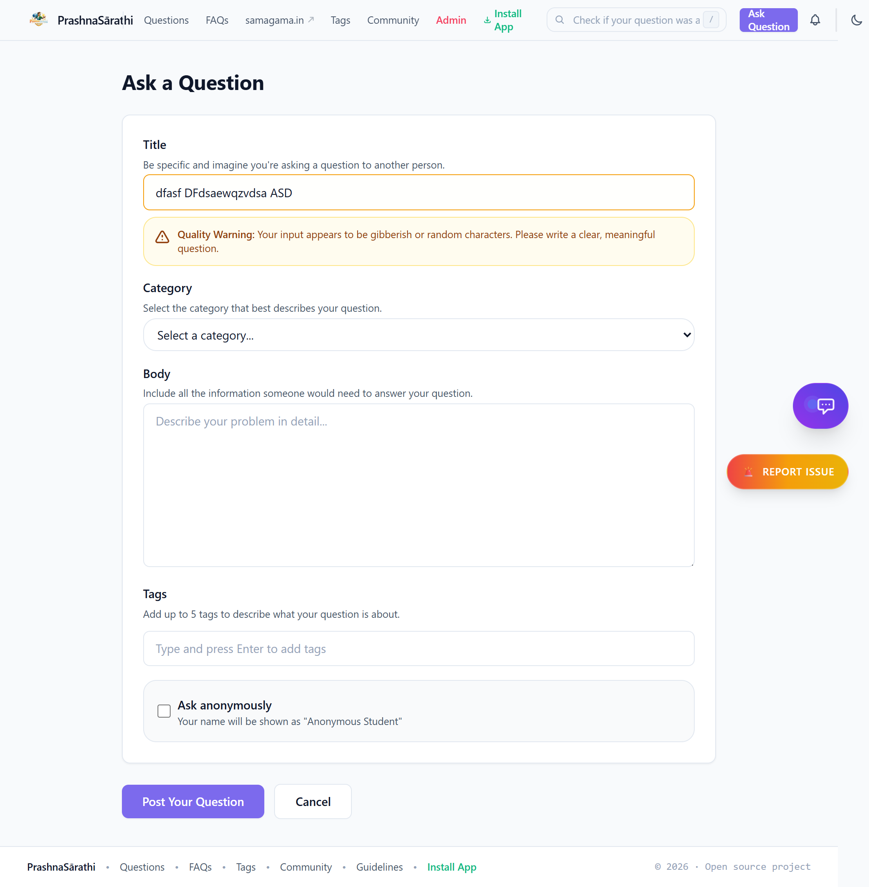
- AI-powered spam and noise classification
- Automatically filters low-quality content
- Maintains high-quality discussions

#### Answer with Confidence
Students can indicate their confidence level when answering:
- 🤔 "I think so" - Partial confidence
- 👍 "Pretty sure" - Moderate confidence  
- 💯 "I know this" - High confidence

#### Voting & Feedback System
- Upvote/downvote with optional reason feedback
- Helps surface quality content
- Provides constructive feedback to answer authors

#### Accept Answer
- Question authors or moderators can mark the best answer
- Visual celebration with confetti effect
- Helps future students find solutions quickly

#### "Me Too" Button
- Students signal they have the same doubt
- Bumps question priority in the algorithm
- Encourages community participation

#### "Solved My Doubt" Button
- Distinct from upvote - tracks genuine problem resolution
- Provides better metrics for answer quality
- Helps identify truly helpful responses

---

### FAQ System

#### FAQs Page
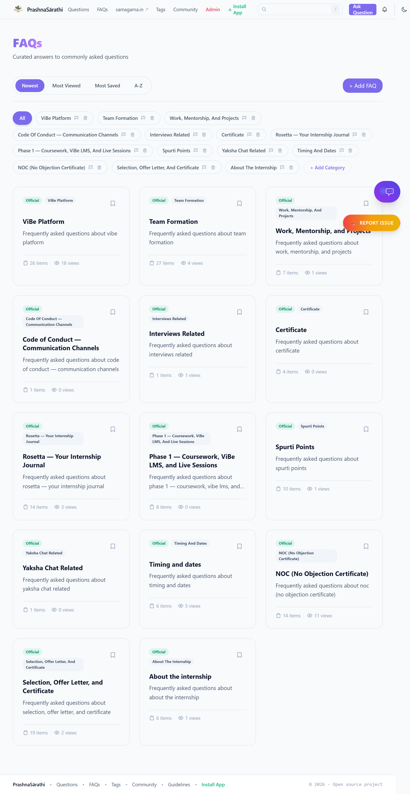
- Organized by subject categories
- Easy browsing and discovery
- Version tracking for updates

#### Detailed FAQ View

- Comprehensive FAQ answers with rich formatting
- Related questions and resources
- Helpfulness feedback tracking

#### Helpfulness Feedback
- Item-level Yes/No feedback tracking
- Helps identify outdated or unclear content
- Drives content improvement

#### Official Badges & Verification
- Verified official answers stand out
- Master FAQ program for canonical answers
- Trust markers for quality content

---

### Search & Discovery

#### Search Modal
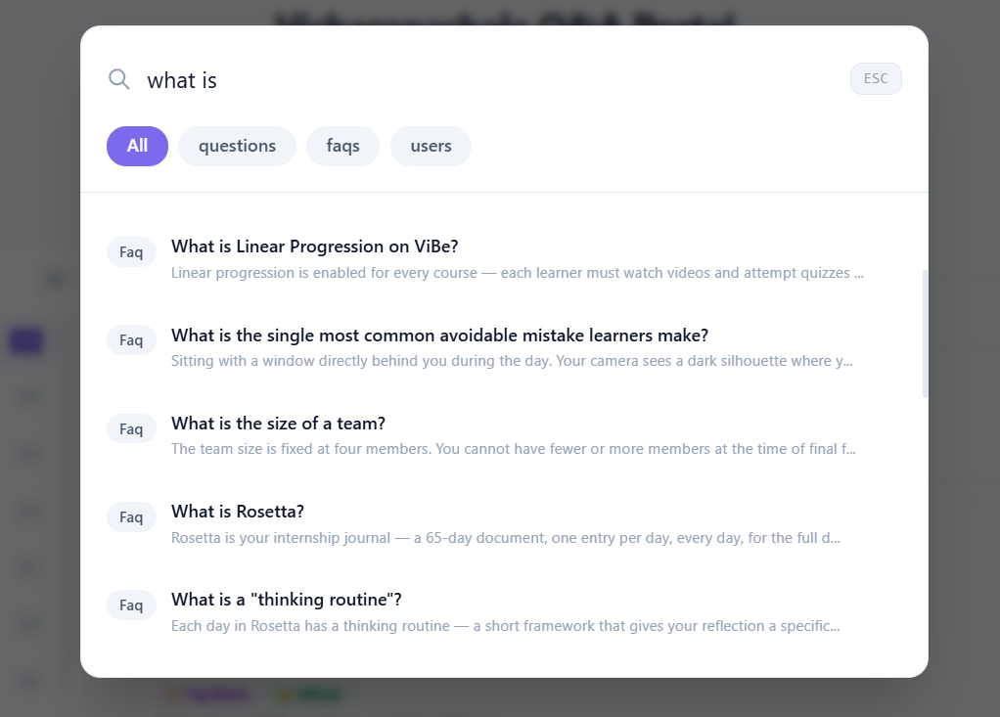
- Full-text search across questions, FAQs, and users
- Press `Ctrl+K` or `/` to open from anywhere
- Elasticsearch-powered for speed and relevance

#### Search Results Page
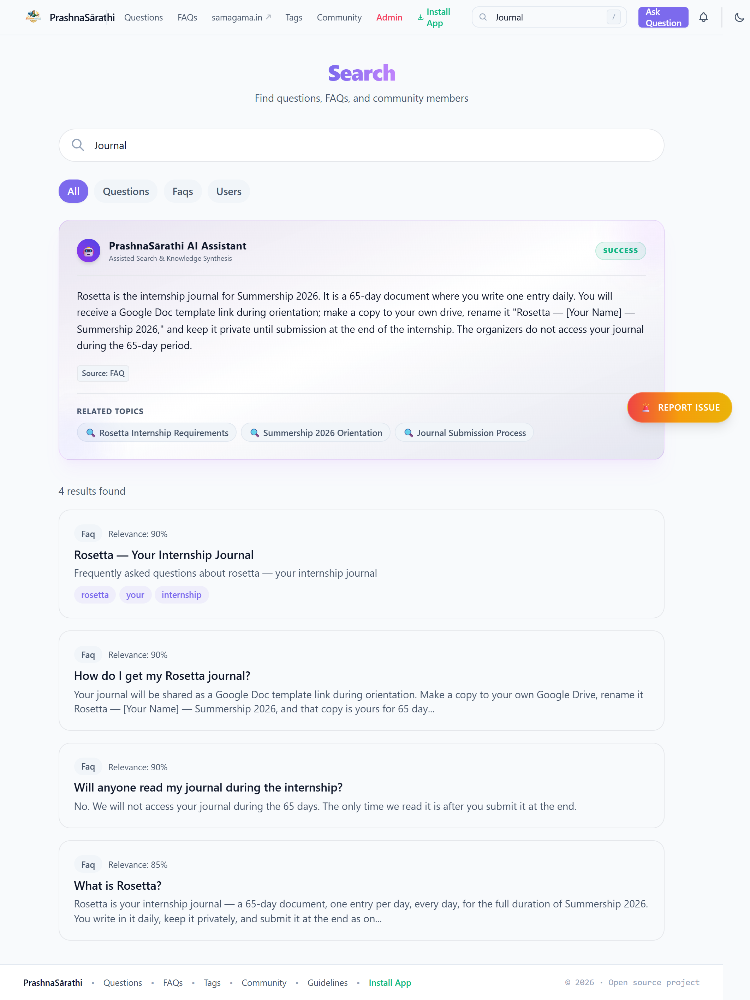
- Comprehensive search results with filters
- Sort by relevance, date, or popularity
- Highlighted matching terms

#### Keyboard Shortcuts

| Shortcut | Action |
|----------|--------|
| `Ctrl+K` or `/` | Open search modal |
| `j` or `↓` | Navigate down in lists |
| `k` or `↑` | Navigate up in lists |
| `Enter` | View/open selected item |
| `Esc` | Close modal or clear selection |

#### Tag Browsing
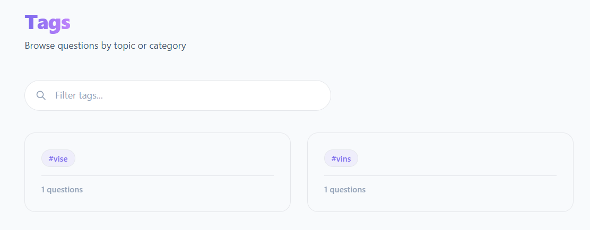
- Browse questions by topic tags
- Filter and sort options
- Related questions sidebar

#### Trending & Suggestions
- Trending searches powered by Redis caching
- Search suggestions with top 10 popular queries
- Real-time autocomplete

---

### User System

#### Authentication
- JWT-based secure authentication
- Registration with email verification
- Session management

#### User Profiles
- Custom avatars and bio
- Reputation system
- Achievement badges
- Activity statistics (questions, answers, votes)

#### Saved Content
- Save questions and FAQs for later
- Add personal notes
- Organize with custom tags
- Easy reference and review

#### Real-time Notifications

- New answers to your questions
- Answers accepted notifications
- Upvotes and "Me Too" alerts
- Live updates via Socket.IO

#### Dark Mode
- Automatic system preference detection
- Manual override with toggle
- Persists to localStorage
- Full dark theme support across all pages

#### Student Onboarding
- 4-step guided tour for new users
- Platform feature introduction
- Encourages engagement from day one

#### Role System
- **User** - Standard access
- **Moderator** - Content moderation privileges
- **Admin** - Full platform control

---

### Admin & Moderation

#### Admin Dashboard
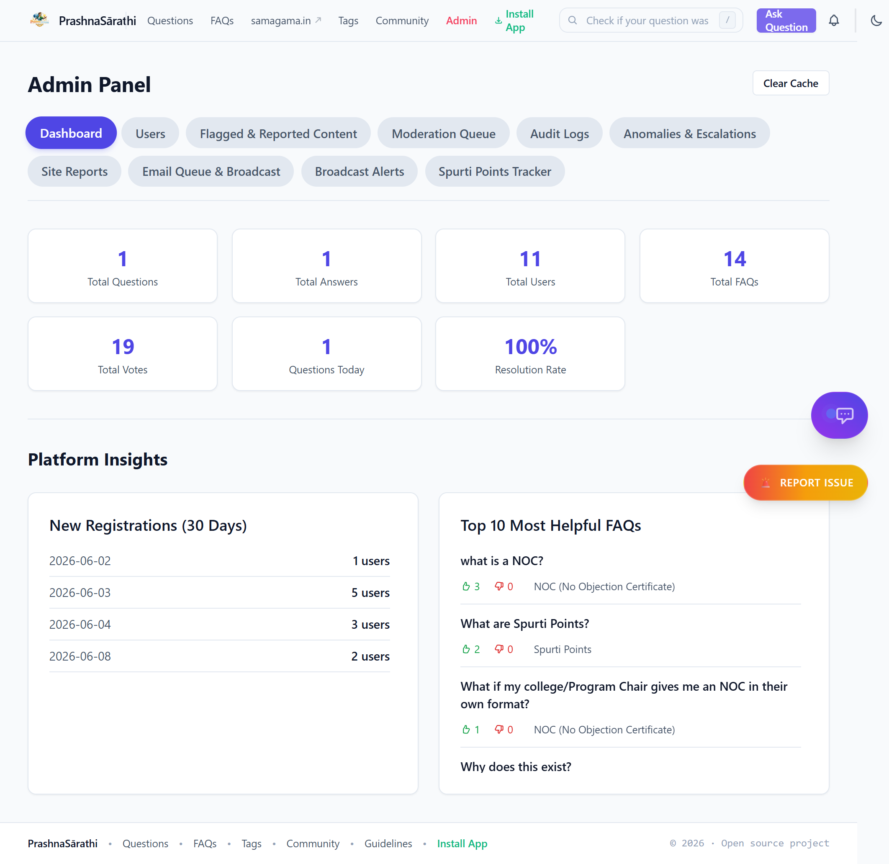
- Real-time platform statistics
- User activity metrics (DAU, questions, answers)
- Quick access to moderation tools

#### User Management
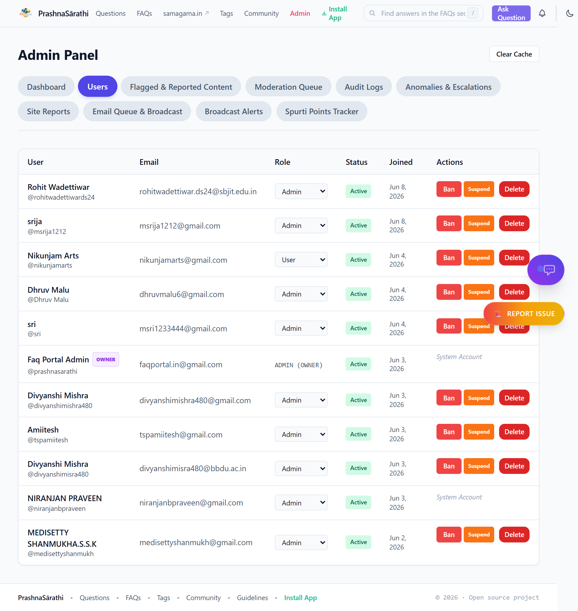
- View all registered users
- Change user roles (User/Moderator/Admin)
- Ban/unban users with reason tracking
- Search and filter functionality

#### Audit Logs
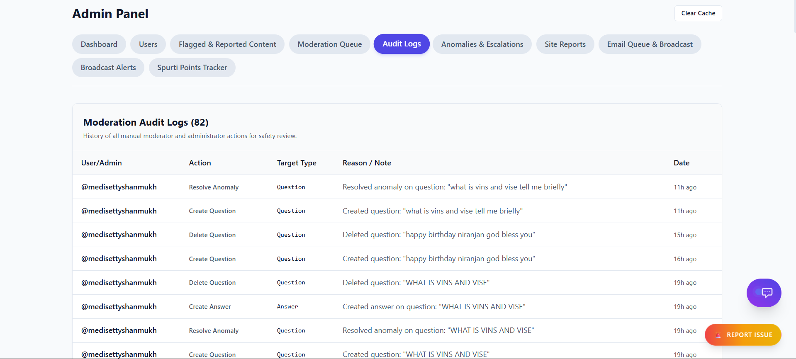
- Track all admin actions
- Moderation history
- Security and compliance monitoring

#### Spurti Points Tracker
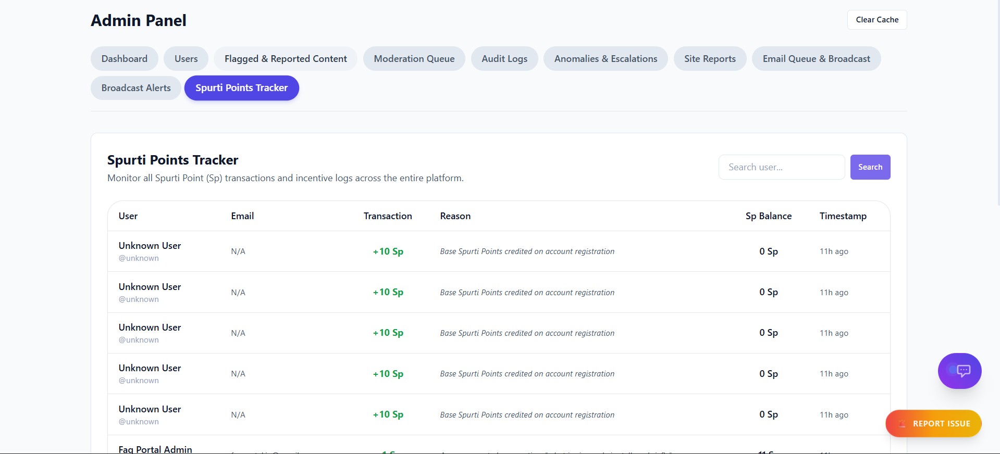
- Gamification points system
- Track user engagement and contributions
- Reward active community members

#### Flagged Content Queue
- Review reported questions and answers
- Approve or remove content
- Track moderation history

#### FAQ Management
- Verify FAQ accuracy
- Mark outdated content
- Promote questions to Master FAQ status

#### Cache Management
- One-click Redis cache clearing
- Improves performance after updates
- Admin-only access

---

### Community Features

#### Leaderboard
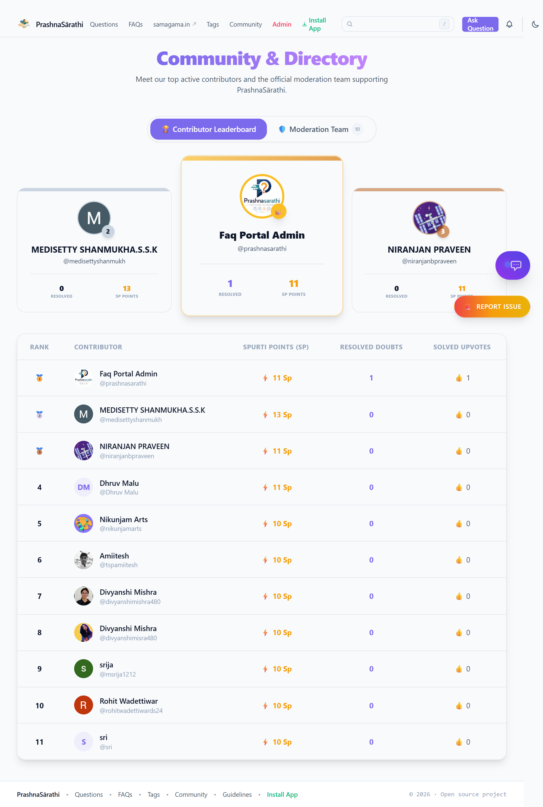
- Top contributors by reputation
- Weekly and all-time rankings
- Encourages healthy competition

#### Moderators
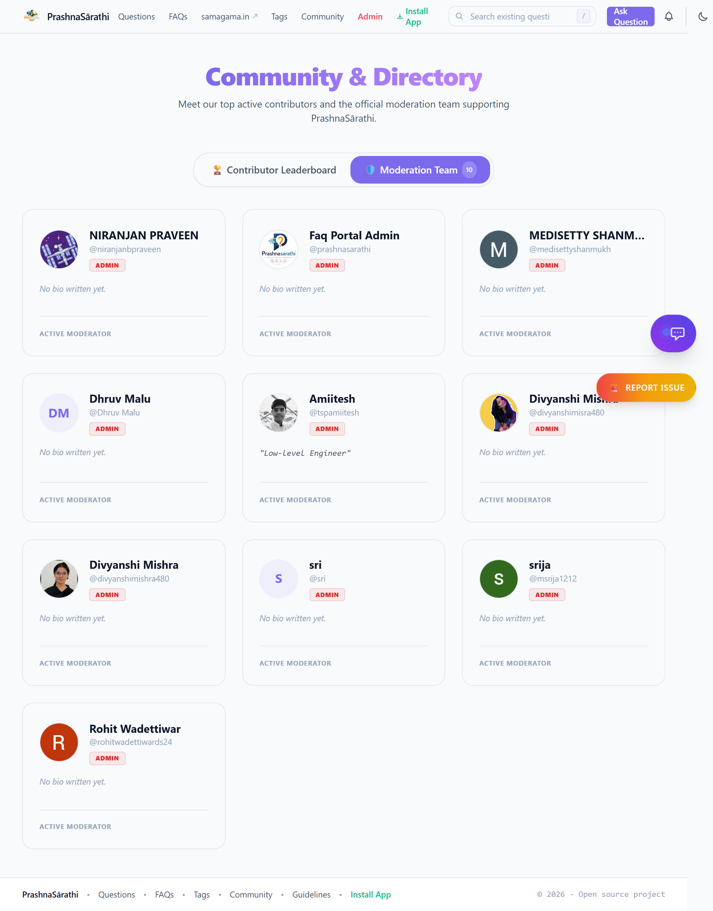
- List of community moderators
- Contact and reporting options
- Transparency in moderation

---

### UI/UX Highlights

#### Rich Text Editor
- TipTap-based WYSIWYG editor
- Formatting toolbar
- Image upload support

#### Markdown Rendering
- GitHub Flavored Markdown (GFM)
- Syntax highlighting for code blocks
- Consistent content presentation

#### Confetti Celebration
- Celebratory animation when answers are accepted
- Positive reinforcement for contributors
- Delightful user experience

#### View Counter
- Track question popularity
- Sort by most viewed
- Engagement metrics

#### SEO Optimized
- Structured data with JSON-LD
- Meta tags for social sharing
- Sitemap generation

---

### Real-time Features

#### Live Notifications
- Toast notifications for new activity
- No page refresh required
- Powered by Socket.IO

#### Real-time Updates
- Me-too counts update instantly
- Answer counts refresh in real-time
- Solved metrics update without page reload

---

## Running on Other Systems

To set up and run this project on a new developer environment or a separate host system, follow these steps:

### 1. Prerequisites
Ensure you have the following installed on the target system:
- **Docker / Podman & Docker Desktop** (with WSL2 enabled if on Windows)
- **Node.js 20.x** (for local host development without containers)

### 2. Environment Configuration (Crucial Step)
Since the `secrets.env` file containing sensitive private keys and credentials is ignored by version control, **you must create it manually** on the target system:

1. Copy `.env.example` to `secrets.env` in the root directory:
   ```bash
   cp .env.example secrets.env